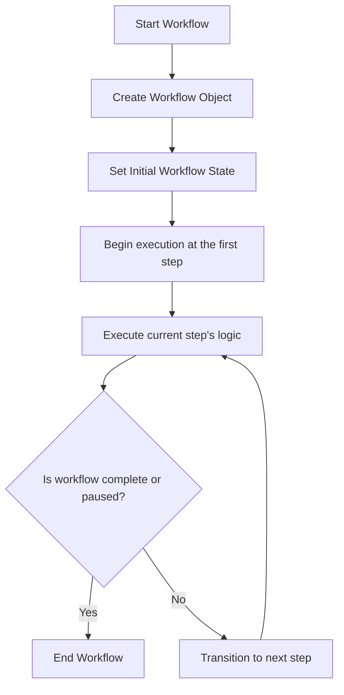

# Rufus SDK - YAML Configuration Reference

This document provides a complete reference for defining and configuring workflows using the Rufus SDK's YAML-based system.
It covers all configuration options, step types, and advanced features.

## 1. The Registry: `workflow_registry.yaml`

All Rufus workflows must be registered in a central registry file. This file tells the `WorkflowBuilder` what workflows are available,
where their definitions are, and what data structure they use.

Each entry in the `workflows` list requires three keys:

*   `type`: A unique string identifier for the workflow (e.g., `LoanApplication`).
*   `config_file`: The path to the YAML file containing the workflow's step definitions. This path is relative to the location of
    the registry file.
*   `initial_state_model`: The full Python import path to the Pydantic `BaseModel` that defines the state for this workflow
    (e.g., `"my_app.state_models.LoanApplicationState"`).

Additionally, the `workflow_registry.yaml` can declare external package dependencies using the `requires` key. These
packages will be scanned by Rufus for additional workflow steps and definitions.

**Example:**

```yaml
# config/workflow_registry.yaml
workflows:
  - type: "LoanApplication"
    description: "A complex workflow for processing a loan application."
    config_file: "loan_workflow.yaml"
    initial_state_model: "my_app.state_models.LoanApplicationState"
  - type: "CustomerOnboarding"
    description: "A simple workflow for onboarding a new customer."
    config_file: "my_app.onboarding_workflow.yaml"
    initial_state_model: "my_app.state_models.OnboardingState"

requires: # Optional: list of packages to auto-discover steps/workflows from
  - rufus-my-custom-package # Rufus will look for entry points and modules in 'rufus_my_custom_package'
  - another-workflow-extension # Can be any installed package
```
## 2. Anatomy of a Workflow Definition File

Each workflow has its own YAML file that defines its steps. The file contains top-level keys and a list of steps.

### Top-Level Keys

*   `workflow_type`: (Required) Must match the type in the registry.
*   `workflow_version`: (Optional) Version of this specific workflow definition.
*   `initial_state_model`: (Required) Python import path to the Pydantic model for the workflow's state.
*   `description`: (Optional) Human-readable description.
*   `steps`: (Required) A list of step definitions.

### Anatomy of a Step

Each item in the `steps` list is a dictionary that defines a single unit of work. The specific properties available depend on the type
of the step. Refer to **Section 3: Step Execution Types Reference** for details on each type and its configuration.

*   `name`: (Required) A unique string name for the step within the workflow (e.g., `"Collect_Application_Data"`).
*   `type`: (Required) Defines how the step is executed. See Section 3 for details on available types and their specific
    configuration.
*   `function`: (Conditional) The full Python import path to the function that contains the business logic for this step (e.g.,
    `"my_app.data_processor.process"`). Required for `STANDARD`, `DECISION`, `HUMAN_IN_LOOP`
    types. For `ASYNC` and `HTTP` types, this points to the task implementation if any.
*   `compensate_function`: (Optional) The full Python import path to the function that contains the compensation logic for
    this step, used in Saga patterns. Applicable for `STANDARD` steps that are designed to be compensatable.
*   `input_model`: (Optional, Recommended) The import path to a Pydantic model defining the expected inputs for this step.
    This enables automatic validation and API schema generation.
*   `required_input`: (Optional, Legacy) A simple list of required input keys. Use `input_model` for new development.
*   `automate_next`: (Optional) A boolean (`true`/`false`) flag. If true, the `WorkflowEngine` will immediately execute the next
    step using the output of the current step as input, without waiting for another `next_step` call. Defaults to `false`.
*   `dependencies`: (Optional, for documentation/visualization) A list of step names that should complete before this one. The
    engine executes steps in order unless altered by directives.
*   `dynamic_injection`: (Optional) Configuration for dynamically injecting new steps at runtime. See Section 7 for details.
*   `routes`: (Optional) For `DECISION` type steps, defines declarative routing rules.

## 3. Step Execution Types Reference

The `type` key controls the execution behavior of a step and dictates its available configuration properties.




### Key Technologies

Rufus leverages a modern Python ecosystem for robustness, performance, and developer
experience.

*   `Pydantic` : Robust data validation and serialization for workflow state and step
    inputs.
*   `YAML` : Domain Specific Language (DSL) for declarative workflow definitions.
*   `FastAPI` (for `rufus-server`) : High-performance, asynchronous REST APIs and
    WebSocket handling.
*   `Celery` (for `CeleryExecutor`) : Distributed task queuing and asynchronous/parallel
    execution.
*   `PostgreSQL` (for `PostgresPersistenceProvider`) : Primary persistence layer with JSONB state
    storage and `FOR UPDATE SKIP LOCKED`.
*   `Redis` : Message broker for Celery and Pub/Sub functionality.
*   `Typer` (for `rufus-cli`) : Intuitive and robust CLI tools.

## 9. Advanced Features

### Saga Pattern (Distributed Transactions)

Rufus implements the Saga pattern to ensure data consistency across distributed systems. If
a workflow fails after several steps, Rufus automatically executes "compensation" functions
in reverse order to undo changes.

**How to use:**

1.  **Define a `compensate_function`** in your step YAML for `CompensatableSteps`:

```yaml
steps:
  - name: "Reserve_Inventory"
    type: "STANDARD"
    function: "my_app.inventory.reserve_items"
    compensate_function: "my_app.inventory.release_items" # Function to call on rollback
  - name: "Charge_Payment"
    type: "STANDARD"
    function: "my_app.payment.charge_customer"
    compensate_function: "my_app.payment.refund_customer"
```
2.  **Enable saga mode** on your workflow instance:

```python
await workflow_instance.enable_saga_mode()
```
### Sub-Workflows (Hierarchical Composition)

Break down complex processes into smaller, reusable child workflows. The parent workflow
pauses while the child executes, with the parent's status dynamically updating to reflect the
child's state (e.g., `PENDING_SUB_WORKFLOW`, `WAITING_CHILD_HUMAN_INPUT`,
`FAILED_CHILD_WORKFLOW`). The parent resumes after the child completes, merging the
child's results into its own state.

**How to use:**

In a step function, raise a `StartSubWorkflowDirective`:

```python
# my_app/loan_steps.py
from rufus.models import StartSubWorkflowDirective, BaseModel, StepContext
# from my_app.state_models import LoanApplicationState # Replace with your actual state model

async def launch_kyc_workflow(state: BaseModel, context: StepContext):
    """Launches KYC verification as a child workflow."""
    raise StartSubWorkflowDirective(
        workflow_type="KYC_Process", # Type defined in registry
        initial_data={
            "user_id": state.applicant_profile.user_id, # Assuming state has this structure
            "document_url": state.applicant_profile.id_document_url # Assuming state has this structure
        },
        data_region="eu-west-1" # Optional: route child to specific region
    )
```
The parent workflow will automatically transition to `PENDING_SUB_WORKFLOW` status. The child workflow's status changes are
then reported back to the parent, causing the parent's status to dynamically update to reflect the child's state.

**Parent Workflow Statuses during Sub-Workflow Execution:**

*   `PENDING_SUB_WORKFLOW` : The child workflow has been dispatched and is currently active or processing.
*   `FAILED_CHILD_WORKFLOW` : The child workflow encountered an error and failed. The parent's metadata will contain
    `failed_child_id` and `failed_child_status`.
*   `WAITING_CHILD_HUMAN_INPUT` : The child workflow has paused, waiting for human input. The parent's metadata will
    contain `waiting_child_id` and `waiting_child_step`.

**Accessing Sub-Workflow Results:**

When a child workflow successfully completes, its final state (and any explicit result returned by its last step) will be merged into
the parent's state within `parent.state.sub_workflow_results`. This dictionary is keyed by the child workflow's ID.

```python
# Assuming LoanApplicationState and processing results
from pydantic import BaseModel
from rufus.models import StepContext
from typing import Dict, Any

async def process_kyc_results(state: BaseModel, context: StepContext):
    """Processes results from the completed KYC sub-workflow."""
    # Access the child's full final state
    # Replace '<child_workflow_id>' with the actual child workflow ID or derive it from context
    kyc_final_state = state.sub_workflow_results.get('<child_workflow_id>', {}).get('state', {})

    # Or, if the child returned an explicit final result from its last step:
    kyc_final_result = state.sub_workflow_results.get('<child_workflow_id>', {}).get('final_result', {})

    if kyc_final_state.get('kyc_status') == "APPROVED":
        if hasattr(state, 'kyc_approved'): # Assuming kyc_approved exists in state
            state.kyc_approved = True
        return {"message": "KYC approved."}
    else:
        if hasattr(state, 'kyc_approved'): # Assuming kyc_approved exists in state
            state.kyc_approved = False
        return {"message": "KYC review required."}
```

## 7. Dynamic Step Injection

Dynamic step injection allows you to modify the workflow's sequence of steps at runtime based on current state or business rules.

**YAML Example:**

```yaml
steps:
  - name: "Evaluate_Risk_Score"
    type: "STANDARD"
    function: "my_app.risk.evaluate"
    dynamic_injection:
      rules:
        - condition_key: "risk_level" # Path in workflow state
          value_match: "high"
          action: "INSERT_AFTER_CURRENT"
          steps_to_insert: # Steps to be injected
            - name: "Manual_Review"
              type: "HUMAN_IN_LOOP"
              function: "my_app.human.request_review"
            - name: "Notify_Fraud_Team"
              type: "FIRE_AND_FORGET"
              target_workflow_type: "FraudNotification"
```

**Rule Properties:**

*   `condition_key`: (Required) A dot-notation path within the workflow state (e.g., "user.profile.age").
*   `value_match`: (Conditional) Inject if `condition_key` equals this value.
*   `value_is_not`: (Conditional) Inject if `condition_key` does NOT equal any of these values.
*   `action`: (Required) Currently only "INSERT_AFTER_CURRENT" is supported.
*   `steps_to_insert`: (Required) A list of step configurations to insert.

## 8. HTTP Step Configuration

The HTTP step type allows your workflow to interact with any external service without writing custom Python wrappers.

```yaml
steps:
  - name: "Fetch_Product_Details"
    type: "HTTP"
    method: "GET"
    url: "https://api.ecommerce.com/products/{{state.product_id}}" # Templating with Jinja2 syntax
    headers:
      Authorization: "Bearer {{secrets.ECOMMERCE_API_TOKEN}}" # Access secrets
      Content-Type: "application/json"
    query_params: # Optional: query parameters
      locale: "en-US"
    body: # Optional: request body (will be JSON for json/application-json content types)
      some_field: "some_value"
    output_key: "product_api_response" # Key to store the response in workflow state
    includes: ["body", "status_code"] # Optional: Filter response fields to save
    retry_policy: # Optional: specific retry policy for this step
      max_attempts: 3
      delay_seconds: 5
    timeout_seconds: 30 # Optional: timeout for the HTTP request
```

**Templating:**

*   Uses Jinja2-like syntax (`{{variable}}`) for dynamic values in `url`, `headers`, `body`, and `query_params`.
*   Context for templating is the entire workflow state and available secrets.

## 9. Advanced Node Types (The "Gears")

These nodes provide high-level control flow and orchestration capabilities.

### FIRE_AND_FORGET

Spawns an independent workflow that runs in the background without pausing the current workflow. The parent workflow only
retains a reference (ID) to the spawned workflow.

```yaml
steps:
  - name: "Send_Confirmation_Email"
    type: "FIRE_AND_FORGET"
    target_workflow_type: "EmailDelivery" # Workflow to spawn
    initial_data_template: # Initial data for the spawned workflow
      user_id: "{{state.user.id}}"
      email_type: "order_confirmation"
      recipient: "{{state.user.email}}"
```

### LOOP

Executes a sequence of steps repeatedly.

* **Iterate Mode (Lists)**

```yaml
steps:
  - name: "Process_Order_Items"
    type: "LOOP"
    mode: "ITERATE"
    iterate_over: "state.order_details.items" # Path to a list in the workflow state
    item_var_name: "current_item" # Variable name for each item within loop_body context
    max_iterations: 100 # Safety limit
    loop_body: # Steps to execute for each item
      - name: "Update_Inventory"
        type: "STANDARD"
        function: "my_app.inventory.update_stock"
      - name: "Apply_Discount"
        type: "STANDARD"
        function: "my_app.pricing.apply_item_discount"
```

* **While Mode (Conditions)**

```yaml
steps:
  - name: "Poll_API_Until_Ready"
    type: "LOOP"
    mode: "WHILE"
    while_condition: "state.api_status != 'READY'" # Condition to continue loop
    max_iterations: 10 # Safety limit
    loop_body:
      - name: "Call_Status_Endpoint"
        type: "HTTP"
        method: "GET"
        url: "https://api.example.com/status"
        output_key: "api_status_response"
      - name: "Extract_Status"
        type: "STANDARD"
        function: "my_app.utils.extract_api_status"
```

### CRON_SCHEDULER

Registers a new recurring workflow schedule. Requires an `ExecutionProvider` that supports scheduling (e.g.,
`CeleryExecutor` integrated with Celery Beat).

```yaml
steps:
  - name: "Schedule_Weekly_Report"
    type: "CRON_SCHEDULER"
    schedule_name: "weekly_report_for_user_{{state.user_id}}" # Unique name for the schedule
    cron_expression: "0 9 * * MON" # Standard cron expression (e.g., "0 9 * * MON" for 9 AM every Monday)
    target_workflow_type: "GenerateReport" # Workflow to be triggered
    initial_data_template: # Initial data for the triggered workflow
      user_id: "{{state.user_id}}"
      report_period: "last_week"
```

## 10. Common Patterns

### Pattern 1: Approval Chain

```yaml
steps:
  - name: "Request_Manager_Approval"
    type: "HUMAN_IN_LOOP"
    function: "my_app.approvals.request_manager_approval"
  - name: "Check_Manager_Decision"
    type: "DECISION"
    function: "my_app.approvals.check_manager_decision"
    routes:
      - condition: "state.manager_decision == 'APPROVED'"
        next_step: "Process_Director_Approval"
      - default: "Notify_Rejection"
```

### Pattern 2: Retry with Exponential Backoff (in Async Steps)

Retry logic is typically handled within the `ExecutionProvider` or within the Celery task itself using libraries like `tenacity`.

```python
# my_app/tasks.py
from celery import shared_task
from tenacity import retry, stop_after_attempt, wait_exponential
import httpx # Using httpx for async HTTP requests
from typing import Dict, Any

# Ensure to import any state models you are using
from pydantic import BaseModel 

@shared_task(bind=True)
@retry(stop=stop_after_attempt(5), wait=wait_exponential(multiplier=1, min=2, max=10))
async def call_external_api_with_retry(self, workflow_id: str, state_data: Dict[str, Any], context_data: Dict[str, Any]):
    # This function would typically load the workflow state and context within the task
    # For demonstration, we assume state_data and context_data are passed directly.
    # In a real scenario, you might re-hydrate the workflow here.
    
    # ... logic to call API ...
    async with httpx.AsyncClient() as client:
        response = await client.post("https://api.example.com/unreliable", json=state_data)
        response.raise_for_status()
        return response.json()
```

### Pattern 3: Scatter-Gather

```yaml
steps:
  - name: "Dispatch_To_Services"
    type: "PARALLEL"
    tasks:
      - name: "Call_Service_A"
        function: "my_app.services.call_service_a"
      - name: "Call_Service_B"
        function: "my_app.services.call_service_b"
    merge_function_path: "my_app.utils.merge_service_results" # Custom function to combine results
```

## 11. Troubleshooting YAML Configuration

### Common Errors

* Error: Workflow type 'MyWorkflow' not found in registry : Ensure your workflow is listed in
  `workflow_registry.yaml` and the type matches exactly.
* ImportError: cannot import name 'my_function' : Verify the function or `input_model` paths in your YAML
  match the actual Python module structure and are importable from your application's Python path.
* Missing 'steps' section : Ensure your workflow YAML file has a `steps` key with a list of step definitions.
* Dynamic injection condition not triggering : Double-check `condition_key` and `value_match` (or
    `value_is_not`) for exact values and correct paths in state.

### Validation

Use the Rufus CLI to validate your YAML files:

```bash
rufus validate config/my_workflow.yaml
```

## Changelog

**Version 0.1.0 (Initial Release)**
  - Core SDK
  - Persistence Provider
  - Execution Provider
  - Workflow Observer
  - Expression Evaluator
  - Template Engine

## Missing Features
- **API Models:** The API models used in `rufus_server/api_models.py` have not been directly reviewed for their alignment with the SDK's internal data structures. While assumed correct, a dedicated review would ensure full consistency.

## Further Considerations
- **Documentation completeness**: While the content now generally aligns, a thorough review of the newly added documentation sections (CLI, Test Harness, etc.) and cross-referencing all examples will ensure full coverage and accuracy.
- **Provider implementations**: The example code now correctly uses `PostgresPersistenceProvider` and `RedisPersistenceProvider`, as well as `CeleryExecutor` and `ThreadPoolExecutorProvider`. It's important to ensure these are consistently reflected across all documentation that refers to providers.
- **`sdk-plan.md`**: All tasks outlined in the `sdk-plan.md` regarding code migration have been completed. The remaining documentation task is being addressed incrementally.
- **Auto-discovery for marketplace packages:** The `rufus-slack` package and `cookiecutter` template have been created as examples. Ensuring that the auto-discovery mechanism correctly integrates and loads these external steps is important for the marketplace ecosystem.
- **Testing**: While `WorkflowTestHarness` has been implemented, it is recommended to ensure comprehensive test coverage for all new features and updated components to maintain stability and reliability.
- **Error Handling and Edge Cases**: A thorough review of error handling and edge cases across the entire SDK, especially in `WorkflowEngine` and provider implementations, is crucial for production readiness.

This concludes the comprehensive review of the provided `YAML_GUIDE.md` against the current SDK.